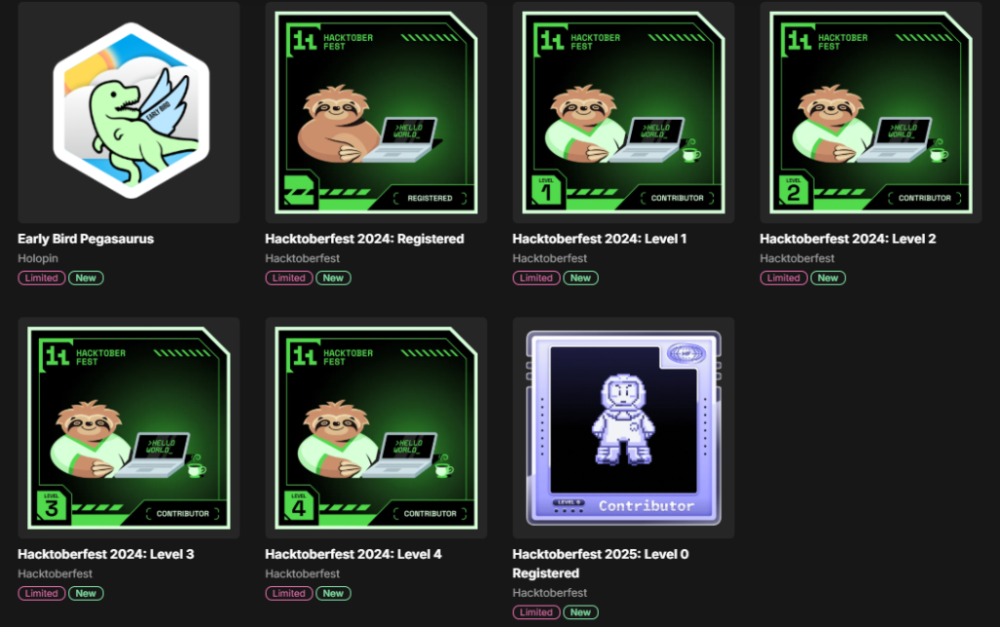

<h1 align="center">
  
  𝐇𝐞𝐥𝐥𝐨, &lt;𝚌𝚘𝚍𝚎𝚛𝚜/&gt;!
  
</h1>

  

  

  

 

  <h2>
    
    
    
    
  </h2>

    
    
    
    
    
    
    
    
    
    
    
    
    
    
    
    
    
    
    
    
    
    
    
    
    
    
    

  
 

<table>
<tr>
<td valign="top" width="60%">

### 🚀 Let's Introduce Myself

- 🔭 Working on **Gen-AI | AI Bots | Web Development**
- 🌱 Learning **AI & Competitive Programming (650+ DSA solved)**
- 👯 Open to collaborate on **Open Source & ML Projects**
- 💬 Ask me anything 👉 [github.com/keshavagr025](https://github.com/keshavagr025)
- 😄 Pronouns: **He/Him**
- ⚡ Fun fact: *The best part of the journey is how it shapes you.*

</td>
<td valign="top" width="40%" align="right">
  
</td>
</tr>
</table>
 
**𝙻𝙰𝙽𝙶𝚄𝙰𝙶𝙴𝚂 𝙰𝙽𝙳 𝚃𝙾𝙾𝙻𝚂:**

 

### Languages

### Databases

### Tools & DevOps

 

**𝙶𝚒𝚝𝙷𝚞𝚋 𝚂𝚝𝚊𝚝𝚜:**

<!-- 🎯 Isometric 3D Contribution Calendar -->

 

<!-- 🐍 Pacman eating contributions -->
<picture>
  <source media="(prefers-color-scheme: dark)" srcset="https://raw.githubusercontent.com/keshavagr025/keshavagr025/output/pacman-contribution-graph-dark.svg" />
  <source media="(prefers-color-scheme: light)" srcset="https://raw.githubusercontent.com/keshavagr025/keshavagr025/output/pacman-contribution-graph.svg" />
  
</picture>

 

<!-- 🔥 Stats + Streak side by side -->

 

<!-- 🏆 Trophies full row -->

 

<!-- 🍩 Donut language chart + 3D calendar side by side -->

 

<!-- ⚡ Profile summary card -->

 

  

  
  

<section>

  <h2 style="font-size: 28px; font-weight: bold; margin-bottom: 15px;">
    𝙋 𝚁 𝙾 𝙹 𝙴 𝙲 𝚃 𝚂
  </h2>

  <!-- IntelliHire AI -->
  

    <h3 style="font-weight: bold; font-size: 20px; color:#10b981;">
      𝚒𝚗𝚝𝚎𝚕𝚕𝚒𝙷𝚒𝚛𝚎 𝙰𝙸 (𝚛𝚎𝚊𝚍𝚢𝙱𝚘𝚜𝚜) – 𝙼𝙴𝚁𝙽, 𝙵𝚊𝚜𝚝𝙰𝙿𝙸, 𝙿𝚢𝚝𝚑𝚘𝚗
    </h3>
    

      GitHub | 
      Live Demo
    

    

      › Implemented scalable backend workflows integrating multiple external APIs for resume analysis, ATS scoring, recommendation systems, and career roadmap generation.
    

    

      › Awarded Runner-up at Hacksagon 2025 among 600+ teams.
    

    

      › Automated PDF parsing and surfaced tailored recommendations via interactive dashboards, reducing average candidate screening time by approximately 40%.
    

  

  <!-- CortexCraft AI -->
  

    <h3 style="font-weight: bold; font-size: 20px; color:#10b981;">
      𝙲𝚘𝚛𝚝𝚎𝚡𝙲𝚛𝚊𝚏𝚝 𝙰𝙸 – 𝙰𝙸 𝙼𝚘𝚌𝚔 𝙸𝚗𝚝𝚎𝚛𝚟𝚒𝚎𝚠 𝙿𝚕𝚊𝚝𝚏𝚘𝚛𝚖
    </h3>
    

      𝙼𝙴𝚁𝙽, 𝙵𝚊𝚜𝚝𝙰𝙿𝙸, 𝙶𝚛𝚘𝚖 (𝙻𝚕𝚊𝚖𝚊 3.3), 𝚂𝚘𝚌𝚔𝚎𝚝.𝙸𝙾
    

    

      GitHub | 
      Live Demo
    

    

      › Architected an AI mock interview platform using Groq (Llama 3.3), increasing candidate shortlist rates by 25% and improving interview performance across 100+ sessions.
    

    

      › Enabled live collaboration for 50+ concurrent users via Socket.IO with sub-100 ms message delivery.
    

    

      › Embedded 5 AI modules including summaries, quizzes, flashcards, mind maps, and interview coaching with Recharts analytics dashboards.
    

  

  <!-- TradeX AI -->
  

    <h3 style="font-weight: bold; font-size: 20px; color:#10b981;">
      𝚃𝚛𝚊𝚍𝚎𝚇 𝙰𝙸 (𝚉𝚎𝚛𝚘𝚍𝚑𝚊) – 𝚂𝚝𝚘𝚌𝚔 𝚃𝚛𝚊𝚍𝚒𝚗𝚐 𝙿𝚕𝚊𝚝𝚏𝚘𝚛𝚖
    </h3>
    

      𝙼𝙴𝚁𝙽, 𝙲𝚑𝚊𝚛𝚝.𝚓𝚜, 𝙹𝚆𝚃, 𝙼𝚘𝚗𝚐𝙾𝙳𝙱
    

    

      GitHub | 
      Live Demo
    

    

      › Constructed a Zerodha-inspired stock trading platform with authentication, portfolio management, holdings tracking, and watchlist functionality.
    

    

      › Initiated RESTful APIs and MongoDB-backed services to manage orders, positions, transactions, and user portfolios.
    

    

      › Implemented JWT authentication and role-based access control to secure trading operations and user data.
    

    

      › Integrated Chart.js-powered market visualizations and analytics dashboards for 10+ simulated stocks, delivering an intuitive trading experience.
    

  

</section>

<!-- <section>

  <h2 style="font-size: 28px; font-weight: bold; margin-bottom: 15px;">
    🏅 𝙷𝙾𝙻𝙾𝙿𝙸𝙽 𝙱𝙰𝙳𝙶𝙴𝚂
  </h2>
  

    
  

</section>

 -->

### 𝙎𝙝𝙤𝙬 𝙨𝙤𝙢𝙚 ❤️ 𝙗𝙮 𝙨𝙩𝙖𝙧𝙧𝙞𝙣𝙜 𝙩𝙝𝙚 𝙥𝙧𝙤𝙟𝙚𝙘𝙩𝙨 𝙮𝙤𝙪 𝙡𝙞𝙠𝙚!

#

